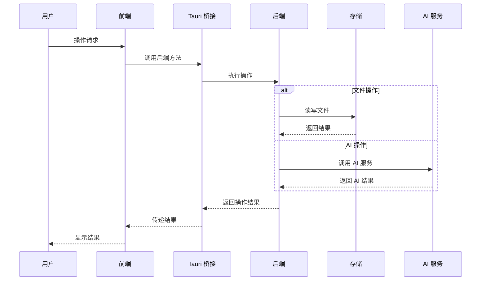

# KNote 项目文档

## 1. 项目概述

### 1.1 项目定位
KNote 是一款面向未来时代的智能知识管理助手，旨在帮助用户更高效地搜索、记录、管理和利用信息，构建个人知识体系。

### 1.2 核心价值
- **智能搜索**：集成多源信息检索，快速获取问题答案
- **知识管理**：系统化记录和组织个人知识
- **任务协作**：高效管理待办事项和项目进度
- **智能辅助**：AI 驱动的内容创作和信息处理

### 1.3 目标用户
- 知识工作者：需要大量信息检索和知识管理的专业人士
- 学生：需要整理学习资料和管理学习任务的学习者
- 创意工作者：需要记录灵感和创作内容的创作者
- 团队协作：需要共享和协作管理知识的小团队

## 2. 功能模块

### 2.1 核心模块

#### 2.1.1 智能搜索模块
- **多源搜索**：集成百度、谷歌等主流搜索引擎
- **搜索历史**：记录搜索历史，支持快速重复搜索
- **搜索结果管理**：结果分类、标签管理、收藏
- **AI 辅助搜索**：智能推荐相关内容，优化搜索策略

#### 2.1.2 知识管理模块
- **文档编辑**：富文本编辑、Markdown 支持、实时预览
- **代码高亮**：支持 Go、Java、Python 等多种编程语言
- **流程图绘制**：内置流程图工具，支持多种图表类型
- **文档组织**：文件夹管理、标签系统、全文搜索
- **版本控制**：文档历史版本管理，支持回溯

#### 2.1.3 任务管理模块
- **任务创建**：快速添加任务，设置标题、描述、优先级
- **任务组织**：分类、标签、截止日期管理
- **任务提醒**：日历视图、提醒通知
- **进度跟踪**：任务状态更新、进度统计
- **批量操作**：批量创建、编辑、删除任务

#### 2.1.4 备忘记录模块
- **快速记录**：支持快捷键快速添加备忘
- **语音录入**：支持语音转文字功能
- **备忘分类**：标签管理、分类整理
- **备忘提醒**：设置提醒时间，避免遗忘
- **搜索筛选**：快速查找历史备忘

### 2.2 辅助模块

#### 2.2.1 用户系统
- **账户管理**：个人信息设置、头像上传
- **数据同步**：多设备数据同步，云端备份
- **权限管理**：团队协作时的权限控制

#### 2.2.2 系统设置
- **主题设置**：明/暗模式切换，多种主题选择
- **语言设置**：多语言支持
- **存储设置**：本地存储路径配置，云存储设置
- **快捷键设置**：自定义快捷键

#### 2.2.3 扩展系统
- **插件管理**：支持第三方插件扩展功能
- **API 接口**：提供外部集成接口

## 3. 技术架构

### 3.1 技术栈
- **前端**：React 18 + TypeScript + Tailwind CSS
- **构建工具**：Vite
- **桌面应用**：Tauri 2.0
- **后端**：Golang (Tauri 后端)
- **AI 集成**：OpenAI API / 本地 AI 模型
- **存储**：本地文件系统 + 可选云存储

### 3.2 技术分层

#### 3.2.1 前端层
- **UI 组件**：React 组件库，包含 Sidebar、Toolbar、Workspace 等核心组件
- **状态管理**：React Context API / Zustand
- **路由管理**：React Router
- **样式系统**：Tailwind CSS
- **编辑器**：Monaco Editor (代码编辑)、自定义富文本编辑器

#### 3.2.2 桥接层
- **Tauri 桥接**：前后端通信桥梁
- **API 封装**：统一的 API 调用接口

#### 3.2.3 后端层
- **文件操作**：本地文件读写、目录管理
- **数据处理**：文档解析、格式转换
- **AI 服务**：AI API 调用、本地模型推理
- **同步服务**：数据同步、备份

#### 3.2.4 存储层
- **本地存储**：文件系统、SQLite
- **云存储**：可选的云存储服务集成

### 3.3 核心流程图

## 4. 界面设计

### 4.1 整体布局
- **左侧**：导航栏，包含功能模块切换、文件目录树
- **顶部**：工具栏，包含常用操作、搜索框、视图切换
- **中央**：工作区，根据当前功能模块显示不同内容
- **右侧**：辅助面板，显示相关信息、工具选项

### 4.2 核心页面

#### 4.2.1 智能搜索页
- 搜索输入框
- 搜索结果展示区
- 搜索历史侧边栏
- AI 辅助建议面板

#### 4.2.2 知识管理页
- 文档编辑区（富文本/Markdown）
- 文档预览区
- 目录导航
- 工具栏（格式设置、插入元素）

#### 4.2.3 任务管理页
- 任务列表视图
- 任务详情编辑
- 日历视图
- 任务统计图表

#### 4.2.4 备忘记录页
- 备忘列表
- 快速添加备忘输入框
- 备忘分类筛选
- 语音录入按钮

### 4.3 响应式设计
- 支持不同屏幕尺寸的适配
- 移动端友好的操作界面
- 可折叠的侧边栏和辅助面板

## 5. 开发计划

### 5.1 开发阶段

#### 阶段一：基础框架搭建（2周）
- 初始化 Tauri 项目
- 配置前端开发环境
- 实现基本界面布局
- 搭建核心组件框架

#### 阶段二：核心功能实现（4周）
- 实现文档编辑功能（富文本、Markdown）
- 实现任务管理功能
- 实现备忘记录功能
- 实现基础搜索功能

#### 阶段三：AI 集成（3周）
- 集成 AI 辅助搜索
- 实现 AI 文档助手
- 开发 AI 任务建议功能
- 优化 AI 交互体验

#### 阶段四：完善和优化（2周）
- 实现主题切换和个性化设置
- 开发数据同步和备份功能
- 优化跨平台兼容性
- 性能优化和 bug 修复

### 5.2 技术实现重点
- **编辑器实现**：基于 Monaco Editor 实现代码编辑，自定义富文本编辑器
- **AI 集成**：封装 OpenAI API，实现智能搜索和内容生成
- **文件系统**：使用 Tauri 的文件系统 API 实现本地文件操作
- **同步机制**：设计高效的数据同步算法，确保多设备数据一致性
- **性能优化**：使用虚拟列表、懒加载等技术优化大文档编辑性能

## 6. 未来规划

### 6.1 功能扩展
- **团队协作**：实时协作编辑、评论功能
- **知识图谱**：自动构建个人知识图谱，展示知识点之间的关联
- **智能推荐**：基于用户行为和兴趣，智能推荐相关内容
- **多模态支持**：支持图片、音频、视频等多种媒体类型

### 6.2 技术演进
- **本地 AI 模型**：集成轻量级本地 AI 模型，减少对云端依赖
- **PWA 支持**：提供 Web 版，实现跨平台访问
- **区块链集成**：使用区块链技术确保数据安全和所有权

### 6.3 生态系统
- **插件市场**：构建插件生态，支持社区贡献
- **API 开放**：开放 API，支持与其他工具集成
- **社区建设**：建立用户社区，收集反馈和建议

## 7. 结语

KNote 不仅仅是一个笔记工具，更是一个面向未来的智能知识管理平台。通过整合搜索、记录、任务管理和 AI 辅助等功能，KNote 旨在帮助用户构建个人知识体系，提高信息处理效率，成为用户的智能知识助手。

随着 AI 技术的不断发展和用户需求的持续变化，KNote 将不断进化，为用户提供更加智能、高效、个性化的知识管理体验。